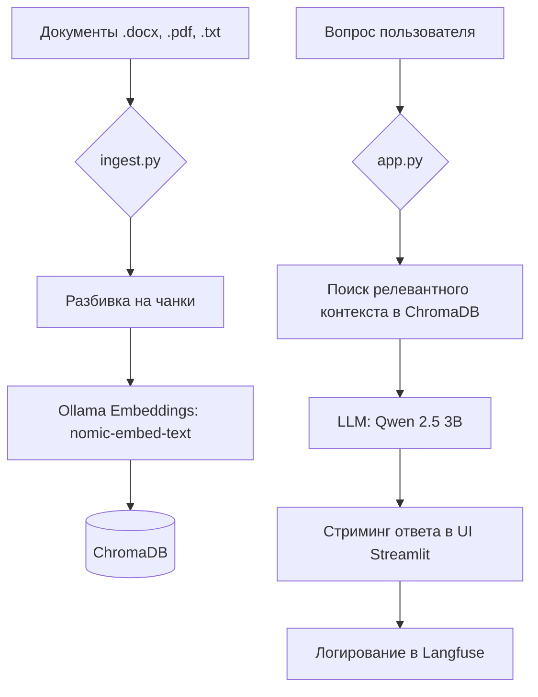

# 🤖 Корпоративный Помощник (RAG Chatbot)

Персональный корпоративный ассистент на базе локальных LLM, способный отвечать на вопросы по вашим документам (PDF, DOCX, TXT) с высокой точностью и поддержкой сложных таблиц.

## 📊 Диаграмма MerMaide

## 🛠 Технологический стек проекта
- **Core:** Python 3.13
- **LLM Engine:** [Ollama](https://ollama.com/) (Qwen 2.5 3B)
- **Embeddings:** `nomic-embed-text`
- **Orchestration:** [LangChain](https://www.langchain.com/)
- **Vector DB:** [ChromaDB](https://www.trychroma.com/)
- **UI:** [Streamlit](https://streamlit.io/)
- **Observability:** [Langfuse](https://langfuse.com/) (Offline OSS)
- **Document Parsing:** `python-docx` (для сложных таблиц)

## ⭐ Сложность
**Сложность:** ⭐⭐⭐ (Middle)
*Проект включает в себя настройку локальной инфраструктуры (Ollama + Docker Langfuse), работу с векторными базами данных, оптимизацию RAG-пайплайна и реализацию стриминга ответов.*

## 🚀 Быстрый запуск
1. Установите зависимости: `pip install -r requirements.txt`
2. Подготовьте базу знаний: `python ingest.py`
3. Запустите чат-бот: `streamlit run app.py`

## 📡 Оффлайн работа
Проект полностью автономен и может работать без доступа к интернету. Инструкция по переносу находится в `offline_guide.md`.
